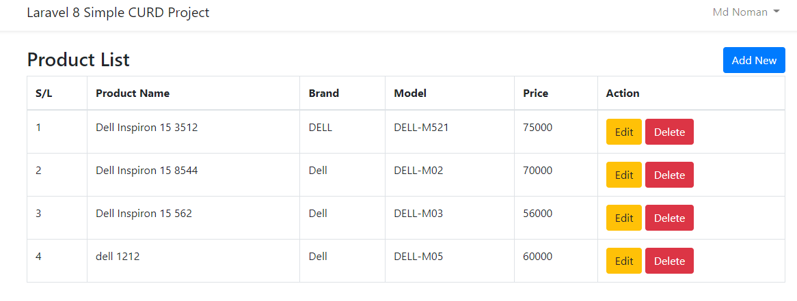
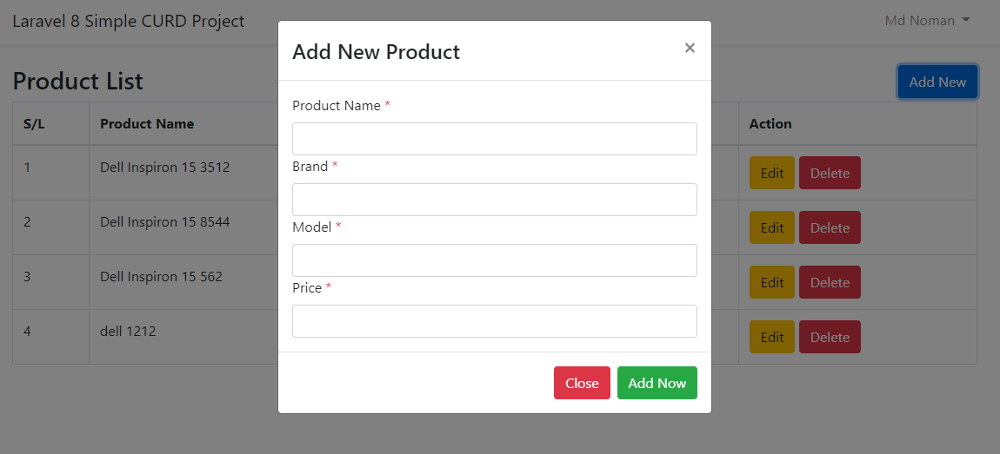
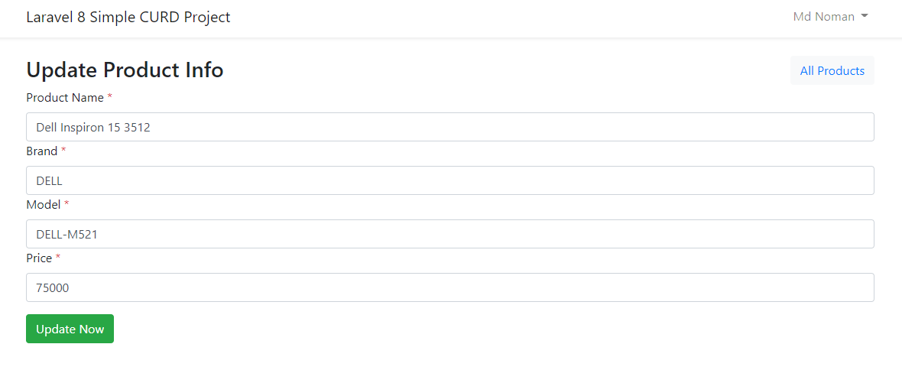

# Laravel8-CURD Project
 This is Laravel 8 application. Here i show simple laravel CURD operation. 

<h5>Product List:</h5>
<!--  -->
<!-- for git view -->

<h5>Add New Product:</h5>
<!--  -->
<!-- for git view -->

<h5>Edit Product Info:</h5>
<!-- for git view -->
<!--   -->

